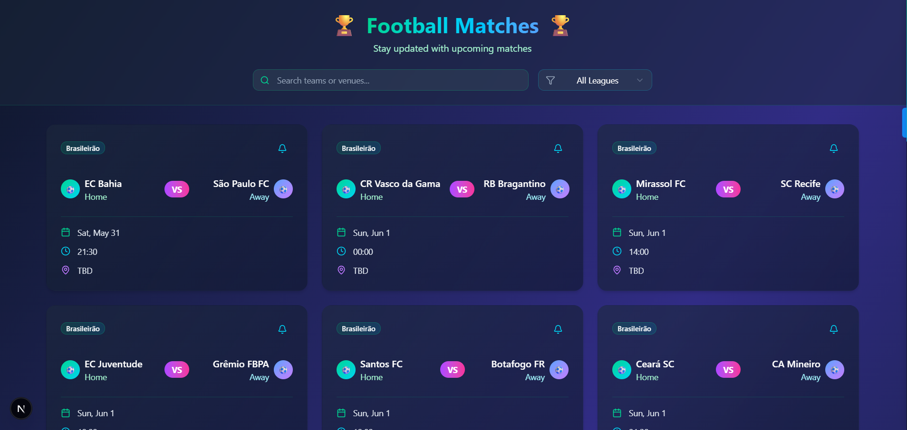

# ⚽ Football Matches – Frontend (Next.js)

A beautiful and responsive **Next.js** app to display upcoming football matches using your custom API. This frontend interfaces with the backend API you created and visualizes match data with filtering, search, and live notifications toggle.

---

## 🎯 Features

- 🔍 **Searchable**: Find matches by team or venue.
- 🏷️ **Filter by League**: Quickly narrow matches down by league.
- 🔔 **Toggle Notifications**: Set match alerts (UI only).
- ⚡ **Real-time Look**: Auto fetch from your Node.js backend.
- 🎨 **Modern UI**: Tailwind CSS + Lucide icons + Gradient cards.

---

## 🛠️ Tech Stack

- [Next.js](https://nextjs.org/) (App Router)
- [Tailwind CSS](https://tailwindcss.com/)
- [Lucide React Icons](https://lucide.dev/)
- [ShadCN UI](https://ui.shadcn.com/) components
- [Node.js Backend](https://github.com/vijit-vishnoi/soccer_db) (for match API)

---

## 📦 Getting Started

### 1. Clone the repository

```bash
git clone https://github.com/your-username/your-frontend-repo.git
cd your-frontend-repo
```

### 2. Install dependencies

```bash
npm install
```

or

```bash
yarn install
```

### 3. Connect to your backend

Make sure your backend is running at:

```
http://localhost:3001/upcoming
```

If not, change the API endpoint in the frontend code (`fetch('http://localhost:3001/upcoming')`) accordingly.

### 4. Start the development server

```bash
npm run dev
```

or

```bash
yarn dev
```

Your app will be available at [http://localhost:3000](http://localhost:3000)

---

## 📡 API Source

This frontend consumes data from the following backend endpoint:

```
GET http://localhost:3001/upcoming
```

Expected response:

```json
[
  {
    "home": "Flamengo",
    "away": "Palmeiras",
    "date": "2025-06-01T23:00:00Z"
  }
]
```

---

## 🧪 Preview




---


## 🧠 Notes

- The notification system is UI-only — no real push notifications.
- League filtering is hardcoded to "Brasileirão" from backend response.
- The `venue` field is marked as "TBD" due to API limitations.

---

## 🌐 Deployment

You can deploy this Next.js app to any of the following:

- [Vercel](https://vercel.com/) (Recommended)
- [Netlify](https://netlify.com/)
- [Render](https://render.com/)
- [GitHub Pages (via static export)](https://nextjs.org/docs/pages/building-your-application/deploying/static-exports)

---

## 📃 License

This project is licensed under the MIT License.

---

## 🙌 Acknowledgements

- [ShadCN UI](https://ui.shadcn.com/)
- [Lucide Icons](https://lucide.dev/)
- [Football-Data.org](https://www.football-data.org/)
